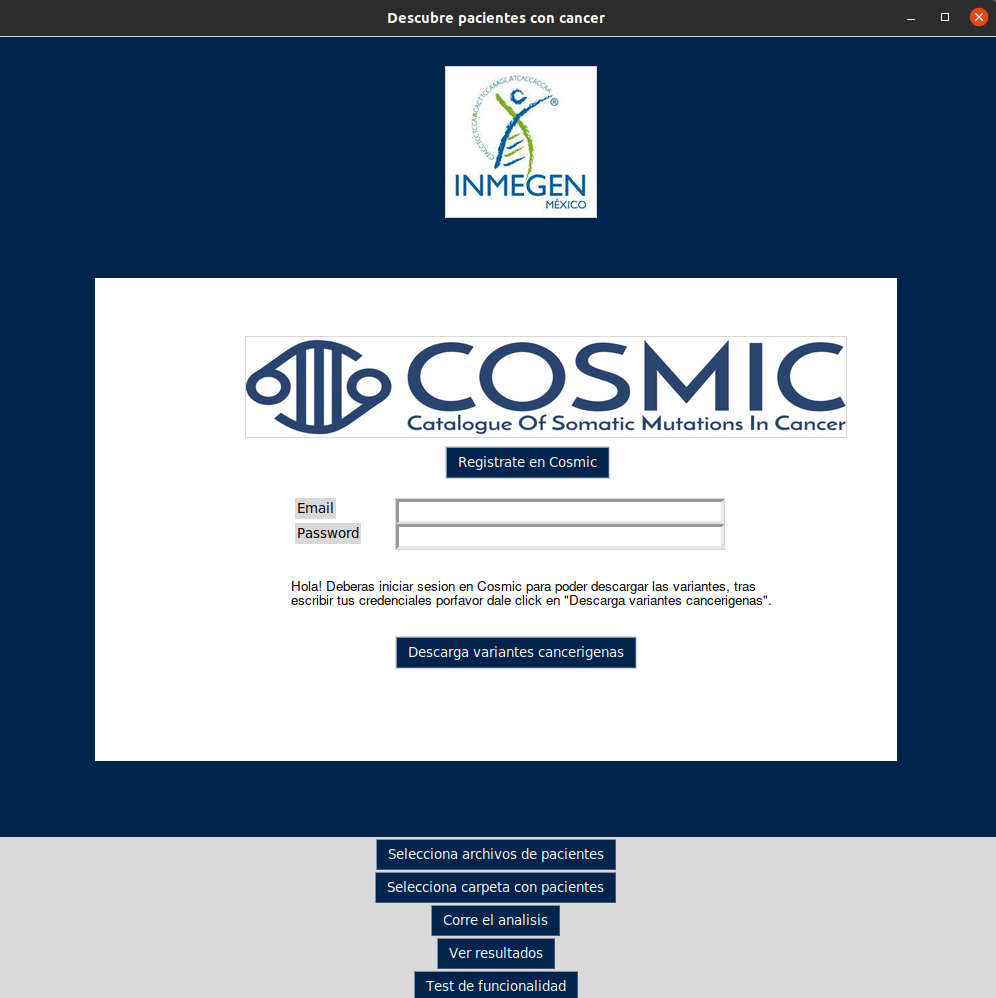

# Filtrado de variantes

# Propósito

Comparar las variantes de pacientes con las variantes de la base de datos de cosmos, el programa deberia de darle la opcion al usuario de poder agregar informacion como cual archivo o directorio con pacientes le gustaria comparar.

# Como usar este codigo

## Cosmic

Para poder usar este codigo tendras que hacer una cuenta en  <a href="https://cancer.sanger.ac.uk/cosmic/register">COSMIC</a> ya que este programa te pedira hacer login con tu cuenta de cosmic.

# Instala el programa

Para poder correr el programa con todas sus funcionalidades tendremos que descargar un par de dependencias de software, para ello necesitaremos correr un script en shell el cual esta en el directorio principal.

Deberas de clonar el repositorio con alguno de los siguientes comandos:

- git clone https://github.com/acerverat/filtrado_variantes.git
- git clone git@github.com:acerverat/filtrado_variantes.git

(Ubuntu)

- sudo chmod +x helpers/installers/install.sh
- sudo ./helpers/installers/install.sh

(Windows)

- helpers/installers/install.exe
-

# Corre el programa

De momento todavia no se agrega la descarga de aplicacion desktop por ende el programa lo puedes correr con:

- python3 views/interface.py

Tras correr tal comando te deberia de aparecer la siguiente interfaz con la cual podras interactuar!

# Testing

Para poder correr los tests

El framework para testing que usaremos sera

Sobre el directorio prueba vamos a usar robot para los tests

python ../json_to_tsv.py input/test.json output/

python3 ../filter_variants.py input/cosmic_prueba.csv output/CA1154-1RNA_475686108_full.tsv output/

# ¿Dudas? Pregúntale a los desarrolladores 📱

- Alejandra Cervera Taboada

Correo electrónico: acerverat@inmegen.gob.mx

Github: https://github.com/acerverat

- rana-frog... Carmen eres tu? xD

Correo electrónico: ?

Github: https://github.com/rana-frog

- Yonathan Jaramillo Ramírez

Número de celular: 5549134787

Correo electrónico: dercomputerschamane@gmail.com

Github: https://github.com/Yony6041

